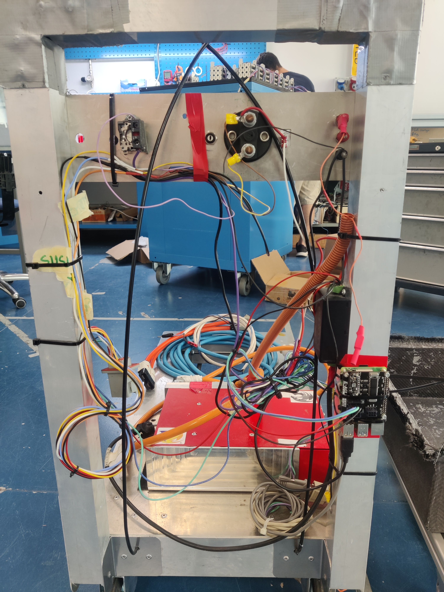
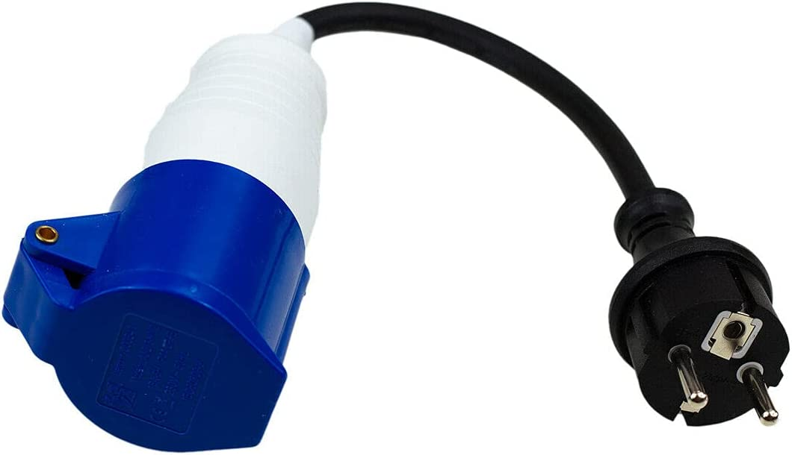

# Handcart Fenice&Chimera 2021-22 Documentation and Guide

## Index

-   [Software](#software)
-	[Hardware](https://github.com/eagletrt/handcart-hw/blob/master/docs/handcart.md)
-   [Resources & Useful links](#resources)

## Intro

The handcart is the device that is responsible of transporting and charging the car's accumulator. It is based on four main components:

-   Brusa NLG513 charger, that is the actual charger
-   Raspberry pi 4 to run the software
-   handcart PCB
-   High Voltage Accumulator

The rasp is connected via CAN Bus with BMS in the accumulator and with the Brusa charger. The software of the handcart is responsible of all the processes to ensure a good and safe charge. The raspi is mounted on the handcart PCB

## Abbreviations

-   BMS, porco, acc -> accumulator
-   HV -> High Voltage
-   rasp -> raspberry
-   FSM -> Finite State Machine
-   TS (on, off) -> Tractive system (HV) (on o off)
- 	SD, shutdown -> the shutdown system giving power to the accumulator AIRs

## The old "carrellino"
Before starting, I want to remember the old handcart, that is now dimissed, that did his job during all these years.



# Charging guide

## Setup procedure
First, you need to know what you’re doing, you’re going to work with High Voltage both AC and DC, that’s no joke. An ESO should be always present during the charge procedure

### Equipment
- CO2 Fire extinguisher should be nearby during all charging process
- At least one ESO
- HV protecting gloves
- A voltage tester

### Finding a good power source
Brusa will be absorbing a maximum of 16A on a 230V AC 50Hz outlet, so a maximum of 3.6kW, if you’re using the 2P+T 16A CEE blue connector there shouldn’t be any problem, otherwise if you’re using the "schuko to 2P+T 16A CEE" adaptor, make sure that the line is properly supporting the 16A load.

Using an undersized socket could be a fire hazard, so BE CAREFUL. Note that it is possible to specify to the BRUSA how much current to absorb (settings tab> brusa in current), for example to match the ourlet you are connected to.

## Connecting the accumulator and giving power
Depending on the accumulator (Chimera or Fenice) you have to choose the right cable. Then:
- Turn off the TSMS key
- Connect the accumulator with the brusa using the HV connector. With chimera make sure that it makes a good contact, sometimes the interlock will not be closed properly.
- Connect the two LV connectors to the accumulator (or just one if using fenice), and the other end to the handcart.
- Once a good power source has been found, connect the brusa to it. You’ll hear a “click” from the BRUSA.
- Make sure the TSMS key is OFF.
- Connect the low voltage PSU to main power.

## Charge Procedure
Make sure that just the people needed are near the handcart, the presence of an ESO is required in a race environment. Make sure a CO2 fire extinguisher is near the accumulator
- Turn ON the TSMS key. From now on, the system could be at >400 VDC.
- Connect to the raspi backend at port 8080 with a browser.
- Go to settings and set the desired charging current limits and voltage setpoint, WARNING! do not exceed rated voltage of accumulator. The accumulator should manage by itself the fans depending on its temperature, but it is a good practice to turn them on anyway.
- Go to home tab, press precharge button
- Airs should close, and the state of the handcart should go to "ready"
- Press charge button, charge should start

In case of any problem, push the red shutdown button in the handcart, this will stop the charge and close the AIRs of the accumulator.

# Backup (Emergency) software

Before starting, follow the set up procedure for the handcart.
It is necessary to initialize the canbus on the raspberry pi, just execute [this](https://github.com/eagletrt/handcart/blob/master/utils/start-can.sh) script.
If you need the handcart working as fast as possible, just download the [charge script](https://github.com/eagletrt/handcart/blob/master/utils/charge_script.py) from github, and execute it on the raspberry pi, you will be guided through the precharge process of the accumulator and the charge settings.

!!! Warning : This software is DUMB, if you set a voltage, the brusa will deliver it, be careful!.
!!! Warning: at the time of writing (18/09/2021) the script supports just chimera’s accumulator, this can be bypassed by reading the next note.
!!! Tip: if you need to bypass the precharge check of the accumulator for any reason, you can set the variable “BYPASS_TS_CHECK” in the script to false, this way the script will not check the presence of the accumulator, and the brusa will work on anything it is attached to.

# Software

## Overview


The software is written in python and javascript. It's divided in two parts, respectively frontend and backend. The backend is responsible to manage the charge and to orchestrate the devices (BMS and brusa) and it also hosts a webserver for the frontend. The frontend is a webapp that runs on the client browser.
The software can be started trough the main.py python script found in backend/ folder. By default, a service can be found in the raspi, namely handcart-backend.service that runs the main.py script on startup. In the folder utils/ you can find a shell script to reset the service.

## Backend

The backend is the part of the software that is responsible to manage the charge and to orchestrate the devices, it also hosts a webserver and a restfulAPI to serve pages and data to the frontend.
Basically it is a python script that launches three threads.

### Threads

The four threads are:

-   The state machine, aka the main thread
-   The flask webserver (API)
-   The CAN read/write process
-   The thread to manage the leds

The three threads have an class istance that they can access which is in shared memory, accessed with a lock.
Other types of communication are two queues:

-   A queue for can msg send between FSM thread and CAN thread
-   A queue for can msg recv between FSM thread and CAN thread
-   A queue for command send between web server and the FSM

### Main thread with FSM

The FSM is based on multiple states:

-   CHECK: It is a state where the presence of the BMS and the BRUSA are checked, if they are both present it will pass to next state
-   IDLE: Both devices are connected and ready to rock, a precharge command is waited
-   PRECHARGE: Accumulator is asked TS ON, wait until a confirmation is received
-   READY: Accumulator is in TS ON, brusa is ready, waiting for a charge command
-   CHARGE: The charge is enabled
-   C_DONE: The charge is finished
-   ERROR: An error state, the charge (if enabled) is stopped, the BMS is asked to TS OFF, the PON of brusa is set to OFF

Note that in each state there's a check over errors from the can, if an error is found, the next state will be ERROR.

Both the BRUSA and the BMS messages from the CAN have a timeout, that if reached makes the FSM to go back to CHECK

#### STATE:CHECK

The presence of BMS and BRUSA is checked, if both are present, goto IDLE

#### STATE:IDLE

Both devices are connected and ready to rock, a precharge command is waited.

#### STATE:PRECHARGE

A TS ON can message is sent to BMS HV, which will do the precharge. In this state we will check if the bms will finish the precharge. Once it did so, the FSM will go to READY state.

#### STATE:READY

The TS is on, we are waiting to receive the charge command from the webserver. We countinously check the queue for new messages.

#### STATE:CHARGE

In this state the charge is enabled, to do this, a variable named "can_forward_enabled" is set to True. This variable is shared between the FSM trhead and the CAN thread.
In the can thread, a check over can_forward_enabled is made, if it's False it will periodically send an empty CAN message to brusa (this is important to keep the link alive, otherwise the brusa will go in an error state if no msgs receivedin 300ms)
If it's True, it will send an enable charge command to brusa with the voltage and current settings. For more info check the brusa CAN messages matrix.

#### STATE:C_DONE

The charge is done, TS is still on, waiting for user input.

#### STATE:ERROR

Something triggered an error, we have to turn off everithing that could be dangerous. The method "staccastacca()" is called. Where a TS_OFF message both for chimera's and fenice's accumulator is sent. The message is sent until a confirmation about the fact that the TS is OFF is received.
In the staccastacca method also the PON is disabled

#### The canread object

The 'canread' object is an istance of a class that is thought to store all the information of the BMS, BRUSA, CAN and others. It is also used to process all the CAN messages. The CAN thread passes the can messages in the CAN queue and the FSM thread checks for new messages in the queue at each cycle, if so the message is processed in the canread object using a method. The canread object is accessed only by the thread of the FSM, the other threads access a copy of that object that is called shared_data.
This is done for safety reason and to assure a fast access without lag to the main thread, as this object contains error state variables.

### Flask HTTP server

This is the server that serve the requests received from the frontend. It uses the shared_data object to retrieve the data from the FSM thread

## Frontend

The handcart's frontend is a webapp based on javascript and html, it fetches the data from the backend by doing RESTFUL requests to the backend.
Charts are created using [amcharts 4](https://www.amcharts.com/) with Javascript method (NOT the JSON method).
To use fetches there are some basic method such as the request-create and the ```POST``` method to submit data.
I strongly recommend you to use the ```formListener``` method that take a form and the partial URL (because we have to send commands only on the ```/command/``` path, so we can avoid things that can't be done).
In forms I create some hidden parameters to identify the command we want to send and it have to correspond with the json parameters shown in the documentation describing the json format.

### include/header.html

Is the top-bar that have all status, number of warnings and errors, and actual value for each parameter needed.
The error and warning's counter can be clicked to access the respective pages.
Every value in the header are calculated by the ```js/status.js``` file, which will be loaded on page loading.
There's also a big ```SHUTDOWN``` button to turn off the charge in every moment, independently whether page you are.

### index.html

This page has six charts: the first on top-left graphically describe the latest voltage values, then you have the charge percentage and the latest current values on the first row.
On the second row there are the latest temperature's chart and two charts about cells voltage and temperature that will work only with Fenice (Chimera still doesn't have these values).<br>
Data are received by the flask server using a fetch for each chart to fill the previous data (30 zeros to avoid graphical issues) and then another fetch will be called to ask the server the last data, in order to have a live chart (every 2 seconds).

### error.html and warning.html

These two pages just print BMS-HV and Brusa errors and warnings in a table.
The ```createTable``` method is inside the ```js/tables.js``` file and look at the json's parameters to create the table.
If you need to print a json with the "title-parameter" in one column instead of on a row, follow the method used in ```brusa-info.html```.

### brusa-info.html

In this page are displayed some Brusa's flags in a table made as described above.

### settings.html

Here you can modify some parameters, such as the Cut-Off voltage, the maximum current outlet and there's a button to enable or disable the fastcharge.

### charts.html

This page can actually display "more pages": it depends on the parameter passed using the ```GET``` method.
This parameter is used to set a title in the page and to decide which chart you want to display.
At this point it will automatically check which chart-function it has to call and calls also the functions to update the header's values.
Those charts won't refresh automatically: you have to refresh the page to see new data, so you can use the zoom (by clicking in the start position and drag until the end position of the zoom).
To see all values about a specific chart there is a function called ```createMultilineChart``` that will create a chart with many lines as parameters that are in the json (timestamp excluded). 

### Chart functions

In addition to chart's creating functions there are some utilities functions in ```/chart/chartsFun.js```: most of them are
in this file just to clear the main one and to reuse them if needed, however they contain the more logical part
(i.e. how to set the correct color using a percentage or how to set the correct position of each cell value according to the real position - check the image below to understand it better).


### CSS

All styles are in the ```css/style.css``` file.

### Images

All used images are in the ```images/``` folder.

### JavaScript

- ```active.js```: Contain a little script to check which page is active, in order to highlight it in the left navigation bar.

- ```const.js```: Contain all constants needed in the whole frontend, to avoid hardcoding.

- ```script.js```: Contains all other kind of functions; every function has its own parameter's description.

- ```status.js```: As mentioned before it contains functions to check the devices' status to refresh the top bar.

- ```tables.js```: As mentioned before it contains all used tables function.

## Raspberry configuration

Follow the guide
here [Rasp config](https://github.com/eagletrt/chimera-steeringwheel/blob/1402786b2e5fb6a07b8e8e68f7986f989c5b448c/tools/README.MD)
. The password of the raspberry is "handcartpi". In the handcart just one CAN bus is necessary.

# BRUSA NLG5 Charger deep dive

The brusa can be controlled using CAN or can be programmed to be used without the CAN.
For our purposes we will control it over CAN BUS.

## Serial connection

To connect with brusa both for debug and/or change the settings we can use the serial interface.
To do so, you have to have an USB to serial adapter, connected to the pins of the BRUSA's connector, check the brusa manual. There are specific settings to set up the serial connection, in german they're called anschlusseinstellungen:

-   Baudrate: 19200
-   Data bits: 8
-   parity: none
-   stopbits: 1
-   protocol: Xon/Xoff

If you are on windows, let the serial COM settings as default, but edit the putty settings, i got
some problems otherwise.
Very important : i don't know why, but if you are going to use ChargeStar software you need
to change the COM port to COM1, otherwise the brusa will not be recognized by the program.
Note that the serial works only if the board on the brusa is fed with 12 volts via the proper pin
2 AUX or with the main power.

to use the serial monitor you have to properly connect and setup the serial, then, use putty on
windows or minicom on linux to connect to it. You will asked with a pasword, which is "monitor"

## ChargeStar software

With the ChargeStar software you can program a charging profile, set various parameters and
change some configuration of the brusa, see the brusa's manual for all the infos. Via ChargeStar
you can also set the mode to CAN, very useful to control the charge via can. The ChargeStar
software will run only on Windows XP or Windows Vista, obviously we'll chose XP, you can
run a virtual machine on virtualbox and do the USB-passthrough of the serial to USB adapter.
I read that somebody had issues with ChargeStar using the 64 bit version of windows, but for
me worked fine. Note that i ran in some problems uploading a custom setting to the brusa:
sometimes when the settings are uploaded, the brusa gives an NVSRAM CRC error, the only
possible fix is reupload the settings to brusa changing some parameters a bit. I'm still not sure which parameter is causing problems, so change them randomly a bit and it should work after some
tries. If you see, some input fields don't accept values with the "." not sure why.

## Connecting by CAN
Connecting with CAN allows to monitor the message outputed by the brusa and (if properly
configured) to set some parameters for charging. The CAN connection has to end with a 120
Ohm resistor, otherwise the messages will keep bouncing (kinda), trust me, it is necessary.
See the full CAN matrix in the manual.
By default the CAN is at 500kbps, unless differently specified in config file with ChargeStar. As
i saw, brusa send messages just when the PON pin is set to HIGH (>5V). To set and enable the
charge via can you have to send periodically a can message named NLG5_CTL see details on
the can matrix.
Note that the endianess is big (motorola).

# Resources & Useful links

- [Handcart drive folder](https://drive.google.com/drive/u/0/folders/1gseosQS0oFUHIKkmOtbPTiWpbAOVRIfS)
- [Frontend REST API Documentation](handcartfrontend.docs.apiary.io)
- [CAN messages reference](https://docs.google.com/spreadsheets/d/1_lV08HAnuSkv5-ramh94GRA4ftQi6S_ziCta-qIculQ/edit)
- [here](https://www.brusa.biz/_files/drive/02_Energy/Chargers/NLG5/NLG5_BRUSA.html) you can find BRUSA's CAN messages
- For pork's can messages search on other E-Agle's repo
- [Fake pointers in python](https://realpython.com/pointers-in-python/#simulating-pointers-in-python)
- [Python threading API](https://docs.python.org/3/library/threading.html)
- [Bootstrap dashboard template](https://getbootstrap.com/docs/4.5/examples/dashboard/)
- [JS Charts](https://www.amcharts.com)
- [Rasp config](https://github.com/eagletrt/chimera-steeringwheel/blob/1402786b2e5fb6a07b8e8e68f7986f989c5b448c/tools/README.MD)
- [Charge state machine of BMS](https://github.com/eagletrt/chimera-bms/blob/sw-charging/src/Src/chg.c)


## Diagram links

- [Shutdown and TS diagrams](https://app.diagrams.net/#G1PoV4TUXfXMDfpv6tKxG6AgJC9CnskumK)

- [1](https://lucid.app/lucidchart/invitations/accept/dbc53a3d-c901-4d6a-a692-972de6713d43)
- [2](https://www.raspberrypi.org/documentation/hardware/raspberrypi/spi/README.md)

# Decisions and info

- EV 4.5.10 Tells that "Every TS connector outside of a housing must include a pilot contact/interlock line which is part of the shutdown circuit. Housings only used to avoid interlocks are prohibited." We have the black connector named "Anderson" which connects the brusa to the adaptor caple for the different accumulators, we want to put it in a container beacuse of the fact that TSMP and resistor has to be placed somewhere, and we didn't like the idea of putting them directly on the cables or the connector. This way we can leave it without the interlock connected to the shutdown.